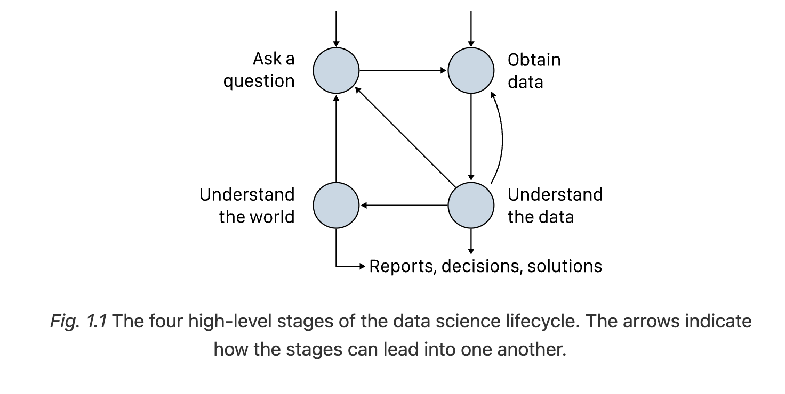

## The Stages of Lifecycle
### 1. Ask a Question
Undertand the Data:
- Descriptive
- Exploratory

Understand the World:
- Inferential
- Predictive

### 2. Obtain Data
- Accessibility: Cheap vs Expensive, Easy vs Hard.
- Quality: Scope, Anomaly, Unusal data, Representativeness, Potential source of bias.
- Prepare: Modify data structure, Data cleaning, Transform measurements.

### 3. Understanding the Data
Exploratory Data Analysis:
- Summarize data visually
- Draw plots to uncover patterns or trends

> This stage is highly iterative: going back to the earlier stages or forth to build statistical models.

### 4. Understand the World
> Quantify how well the trends we find generalize beyond our data.
- Build a model to make inferences (e.g. from sample to population)
- Make predictions for future observations (machine learning)

